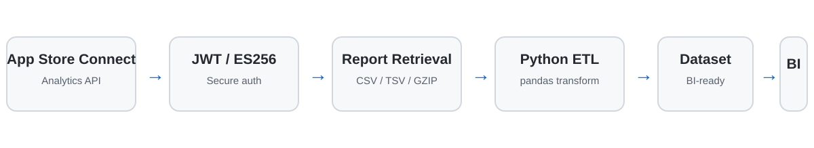

# App Store Connect Analytics Pipeline

**Python analytics pipeline for App Store Connect using JWT authentication, REST APIs, pandas, and BI-ready transformations.**

**Skills:** Python • App Store Connect API • REST APIs • JWT / ES256 • pandas • ETL • Data Transformation • Power BI • Automation

## Business Problem

App performance data in App Store Connect is accessed through API-based analytics reports that require authentication, report retrieval, compressed-file handling, and transformation before the data is suitable for business reporting.

This project automates that process and converts selected app analytics metrics into a standardized monthly dataset for BI consumption.

## Architecture



```text
App Store Connect API → JWT Authentication → Report Retrieval → Python ETL → BI Dataset → Power BI
```

## Key Features

- JWT authentication using ES256
- Automated analytics report retrieval
- App Store Connect REST API integration
- GZIP, CSV, and TSV report handling
- pandas-based data cleaning and aggregation
- Environment-based configuration
- BI-ready dataset preparation

## Key Engineering Decisions

### Secure API authentication

The pipeline uses short-lived JWT tokens signed with ES256 for authenticated access to App Store Connect.

Private keys and identifiers are loaded from environment variables and local configuration rather than embedded in source code.

### Compressed report processing

App Store Connect analytics reports may be delivered as compressed downloads. The pipeline detects GZIP content, decompresses it in memory, identifies the delimiter, and loads the result into pandas.

### Reusable metric extraction

Metric rules are defined separately from the retrieval logic so additional KPIs can be introduced without rewriting the full pipeline.

### Reporting-oriented transformation

Raw platform reports are converted into a consistent analytical structure that can be stored in CSV, a database, a REST-backed store, or another reporting layer before being consumed by Power BI.

## Sample Output

| Month | App | Metric | Value |
|---|---|---|---:|
| 2026-01 | Demo App A | Impressions | 84,200 |
| 2026-01 | Demo App A | First-time Downloads | 5,230 |
| 2026-02 | Demo App A | Impressions | 91,450 |
| 2026-02 | Demo App A | First-time Downloads | 6,120 |
| 2026-02 | Demo App B | First-time Downloads | 2,880 |

*Example values are illustrative only.*

## What This Project Demonstrates

- Building authenticated API-based analytics pipelines
- Working with JWT and ES256
- Integrating with REST APIs
- Processing compressed analytics reports
- Transforming raw platform data with pandas
- Designing reusable metric extraction rules
- Preparing datasets for Power BI and recurring reporting
- Keeping sensitive configuration outside source code

## Project Structure

```text
app-store-connect-analytics-pipeline/
├── appstore_pipeline.py
├── analytics_requests.example.json
├── requirements.txt
├── .env.example
├── .gitignore
├── docs/
│   └── architecture.svg
└── README.md
```

## Getting Started

Install dependencies:

```bash
pip install -r requirements.txt
```

Configure the required environment variables using `.env.example` as a reference.

Create your own local `analytics_requests.json` from:

```text
analytics_requests.example.json
```

Then run:

```bash
python appstore_pipeline.py
```

## Security

Do not commit:

- Apple `.p8` private keys
- API credentials
- Real analytics request IDs
- Passwords
- Production endpoints
- `.env` files
- Organization-specific identifiers

## Portfolio Note

This repository is a sanitized demonstration of a production analytics pattern. All organization-specific names, identifiers, credentials, and endpoints have been removed.
